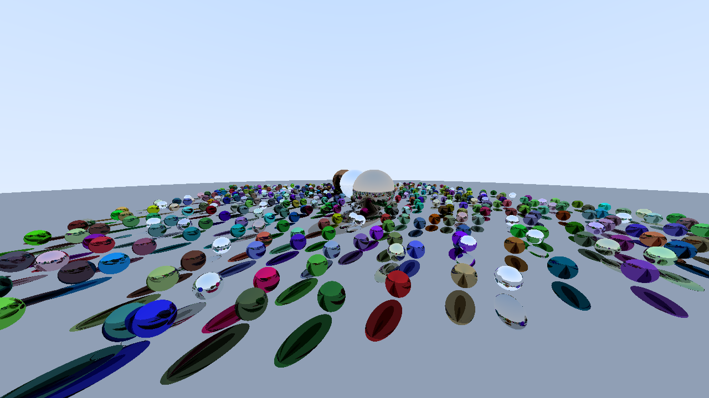

# Ray Tracing Project 🚀

A high-performance ray tracer built with C++ and CUDA to generate photorealistic images. This project simulates the physics of light to render scenes with complex interactions, including reflections, refractions, and soft shadows.



***

## 🌟 Design

1.  **CPU Rendering with Multi-Threading:**

The initial implementation was based on **Peter Shirley**'s fantastic book, **Ray Tracing in One Weekend**. This served as the foundation for the core logic, including classes for vectors, rays, and materials. While functional, this single-threaded version was quite slow. Using **gprof** to identify bottlenecks and by implementing a **thread pool** to parallelize the rendering work across CPU cores, the rendering time for the final scene was reduced from minutes to under three seconds.

2.  **Initial GPU Port with CUDA:** 

To unlock massively parallel performance, the project was ported to **CUDA**. This first pass was a direct adaptation of the C++ object-oriented design. While it successfully moved the rendering workload to the GPU, it retained the original class structures, including **virtual functions** for material dispatching. This approach, while functional, is not optimal for the GPU architecture due to the overhead associated with virtual table lookups, which can hinder performance in parallel workloads.

3.  **High-Performance GPU Rendering with POD:**

The final and most significant optimization was a complete refactor of the data structures to a **Plain Old Data (POD)** format. All object-oriented patterns, especially virtual functions, were replaced with a more GPU-friendly approach using enums and function tables for dispatching. This transformation ensures that all data sent to the GPU is simple, contiguous, and free of hidden overhead, allowing the hardware to achieve maximum throughput. This extensive refactoring resulted in a substantial performance gain and represents a standard, high-performance pattern for modern CUDA applications.

***

## Benchmark data
TBD

## 🛠️ Getting Started

Follow these instructions to get a copy of the project up and running on your local machine for development and testing.

### Prerequisites

Make sure you have the following installed:

* **NVIDIA GPU:** A CUDA-enabled NVIDIA GPU is required.
* **NVIDIA CUDA Toolkit:** [Download and install the CUDA Toolkit](https://developer.nvidia.com/cuda-downloads).
* **C++ Compiler:** A C++ compiler that is compatible with your CUDA version (e.g., GCC, Clang, or MSVC).
* **Xmake:** https://xmake.io/#/getting_started.

### Installation & Building

1.  **Clone the repository:**
    ```sh
    git clone [https://github.com/fafamao/tracing.git](https://www.google.com/search?q=https://github.com/fafamao/tracing.git)
    ```

2.  **Build the program:**
    ```sh
    xmake build tracing
    ```

3.  **Run the program:**
    ```sh
    xmake run tracing
    ```
***

## 🏃‍♀️ Usage

